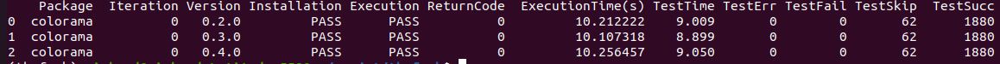
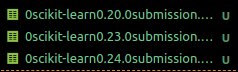
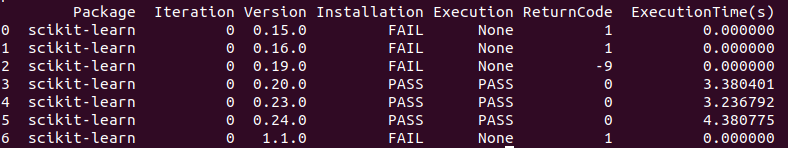
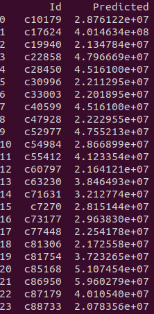

# Varypy

This a information markdown on the project and a tutorial on how to use varypy.

## What is it
Varypy is a tool that has been develop with the intent to be able to test variations on python programs/projects configurations and observe if there is any change in behaviour with said changes.

The idea behind this is to be able to measure any differences when variations are applied to configurations of python programs/projects so that we can observe if the current configuration has an impact on the results/outputs of the program/project being tested.

This testing is to ensure that there is no other variables to account for when using a program other than the program it self.

## State of art

There is already tools that exists that can test python project configuration.

A popular one is Tox, which is a testing tool that aims to automate and standardize testing in Python. It is part of a larger vision of easing the packaging, testing and release process of Python software. 

tox is a generic virtualenv management and test command line tool you can use for:

* Checking that your package installs correctly with different Python versions and interpreters

* Running your tests in each of the environments, configuring your test tool of choice

* Acting as a frontend to Continuous Integration servers, greatly reducing boilerplate and merging CI and shell-based testing.

For more info you can check out : https://tox.wiki/en/latest/

## How varypy works
Varypy works mostly in 2 differents ways : 
* It can have as an argument a python program/script.
* You use the --test option if your project has test suite. 

For now varypy has 2 scripts :
* cyclePackage.py, that handles all the package cyclying.
* varypy.py, that construct the data from cyclePackage and handles virtual env setup.

Technicaly, if it is implemented by the end of the internship, you only need to launch varypy.
As of now using varypy is used for the creation of dataframes and mean of csv files.

cyclePackage must be called from an virtual env where the project of your choice is install or where the program to be tested is.

cyclePackage posseses multiple option that you can use for specific testing.

cyclePackage once launched will then begin multiple process with module subProcess :
* It will fetch all the versions of the package to be cycled with the use of `pip-version`.
* It will then filter this list to fetch either major,minor or patches version of said package.
* It will then, with the use of `pipenv`, install in the virtual env one at a time the version from the list of version filtered previously.
* It will then either execute the program passed as an argument or execute the test suite for each version being iterated on. 
* It will then create a dictionnary with all the results from those iteration and the dump this result in a JSON file.

varypy if executed outside the virtual env will then :
* Open the JSON file and create a dataframe from it.
* Ouput the result on stdout.

Right now if you call varypy first and in a virtual env it will probably not work.

A more detail explaination on how to use is in section Step by step usage.

## How varypy is suppose to work

As mention above the work is not complete yet and much is still to be done in term of error handling and functionnalities.

Varypy is suppose to work like this :
* Do all the work in the How it works section, but only from varypy.
* Handle all option from cyclyPackage and more.
* Handle the features supposed to be implemented like virtual env managing, data ploting, be able to cycle all of the packages required by the project of program.


## Requirements 

Varypy has to be called from the root of the project tested or with the path absolute path.

For varypy.py to work you need on your system :
* `pipenv` which will handle the virtual environnement and installation of packages, installed only for user "-u" as global installation has some interaction problems.
* `pip-version` which is a tool to fetch versions of a package.
* `pyenv` for now is optionnal as in you can use it manually with pipenv --python TEXT option to setup a virtual env. with a different version of python.
* `pandas` which is a package used as a module in varypy.py to construct the result of the data fetch by cyclePackage.py.
* `matplotlib` package used as a module to plot the data constructed by pandas dataframe.

For cyclePackage.py to work you need in the virtual env. :
* `pytest` which will be able if there's any test suite to run it and fectch it's result. It is important to note that only `pytest` has been used during the developpement of the script, so your milleage may vary if the tested project has a test suite written for another testing frameworks.

## Step by step usage

For an example of projects that works here a the step to follow :

### First example

This works for the project thefuck.

1. First fork thefuck project into a directory,then in this directory use pipenv to setup the project :
    ```
    pipenv install -e .
    ```
This will install the project as a package and setup a virtual env with
all of the necessary dependencies of the package.

2. Then install the requirements.txt file, which install the packages necessary for the test suite in the project.
    ```
    pipenv install -r requirements.txt
    ```
Those installation will create and update a pipfile and pipfile.lock that are file to store the configuration of the project.

Now that everything is suppose to be correctly installed, we can proceed with the execution of cyclePackage, so if cyclePackage is in the directory and let's say you want to test your config for the package colorama with the minor versions : 

4. First you have to enter the virtual env :
    ```
    pipenv shell
    ```
5. Then you can execute cyclePackage :
    ```
    python3 cyclePackage.py --releasetype minor -t colorama
    ```
So this command will execute the test suite for package colorama with minor versions.

It will create a JSON file with the results of those execution that can then be displayed by varypy.

6. To do so you need to exit the virtual env with the command :
    ```
    exit
    ```
7. And the use varypy to display the results :
    ```
    python3 varypy.py --releasetype minor -t colorama
    ```

Just for future proofing it is best to use the same arguments as cyclePackage since cyclePackage is not supposed to be accessed.

You should then have a dataframe looking like this :


### Second example

There is also another example that you can use, which is sdt.py.

It is a program that needs datasets and output nothing rather it creates a csv of the output. 

For the purpose of testing this particuliar program, there is an option that you can use called outputfile. It takes the name of the file output by your program, if it's a csv, and uses it to generate outputs based on the actual config of the project/program being tested by varypy.

This option is very much designed around sdt.py it self so trying it on other programs might not work.

1. The program has only a requirements.txt, so you can repeat step 2 to 4 from the first example and skip step 1.

2. Now you should be in your virtual env, you can proceed with :
    ```
    python3 cyclePackage.py --prog sdt.py --releasetype minor scikit-learn --outputfile submission.csv
    ```
You should now have 3 files based on the result of cyclePackage :



They follow this naming : iteration + pacakge + version + outputfile .csv

3. You can now use varypy again with the same arguments :
    ```
    python3 ~/projet/varypy/varypy.py --prog sdt.py --releasetype minor scikit-learn --outputfile submission.csv
    ```
It should output something like this : 


It may vary though since installation is sometimes a bit finicky.

You now you should have an std output of the mean of all csv generated, it should look something like this :


Those result have been obtained with a subset of the data sets required for sdt.py to function, if you want more info on sdt or want to test for the complete data sets you can check out :
https://www.kaggle.com/code/lllmmm45/simple-decision-tree

You'll find the main program and the full data sets there.

## Difficulties and tips

There is a bunch of difficulties just by the design of the project as a whole.

One major difficulty is that once in the virtual env, it becomes difficult if varypy itself is relying on packages that have to be installed.

Which was what it did at first, it was creating the dataframes directly in the virtual env. 

Since packages like pandas which is used to make dataframes, could have their version changed inside the virtual env, varypy of course was crashing since changing versions was also impacting varypy.

The simplest solution was to make the script used inside the virtual env completly none reliant on specific packages, basically free of any dependencies.

Another difficulty is to be able to find which package to test aka your project installed as a package in a virtual env.

Installing any project with a setup.py actually builds the project as a package.

The problem then is to determine how do you fetch the name of said package without necessarily passing it as an argument.

A restricive problem is also to fetch the dependencies of the dependencies.

For example sdt.py that uses scikit-learn as multiple dependencies. One of them is numpy and another is scipy. The thing is that numpy being a dependency of scikit-learn is also a dependency of scipy. There then you have a problem where you have to know which version of required from all dependencies and do the intersection of all of those requirements to find the exact range where you can test the program without a installation failure.

One other important thing is to not forget that with this implementation, varypy is testing in a iterative way multiple versions of pacakges. Since it's iterative, if you test for another package in the config, you should take into account the fact that you are testing with the latest version of the previous package tested and not the version of the package the project shipped with. Which might alter results.

One thing that is not also very exploitable right now is the dataframe created once all the cyclying by cyclePackage has been done. There is a bunch of data that is purely used for report of installation and execution of the program except they are strings and so not very exploitable in a plot.

One simple way to fix this problem would then be to just change what's in the dataframe and for example make something like this :

|  pandas |  numpy |  scikit-learn | scipy  | ExecTime  |
|---|---|---|---|---|
|  1.0.4 | 1.0.2  | 1.0.0  | 1.0.3  | 800  |

Another thing is to be able to tell which testing tool is used by the projects if there's any. Since varypy has been developped by using thefuck, it relied on pytest for testing, but it's not the only unit testing framework that exist. Although pytest is supposedly compatible with other frameworks it might be best pratice to be able to tell which one is used and to act accordingly.

## Easier solution

One thing that was reflected upon near the end of the intership, is that it is possible to cycle configuration directly and not bother with every package in a iterative way.

The idea behind that would be then for projects with a setup.py to :

1. Use pipenv to install the project if it has a setup.py.
2. Use pipenv to fetch the versions of depencencies with graph --json-tree option.
3. Use a solver (create one), to generate every combination possible from the range fetch at step 2.
4. Then test for every combination of versions (aka a config), by dumping the config in a requirements.txt. Example : (pandas==1.0.4\n numpy==1.0.2\n).
5. Once you have all the config (which will probably look like a lot of requirements.txt), varypy will probably follow the same execution pattern as in test for the config, collect outputs and dump them in a json file, construct the dataframe from the json file.

This solution seems easier and less bothersome since there's is technically less pipenv call.

## Conclusion

There is a lot to encompass with this project, a lot of things that you have to pay attention to.

Since it was a fresh project, there was a lot of trial and errors, lot of research, and lot of walls hit.

But taking into account all of that, it is possible to do variations on the configs and collect data from it.

The project in its state is mostly to demonstrate that it is fesable, but that there is some challenges. And although the project is working and displaying data, in retrospect it was probably not the best way to do it. The correct way then would be the solution mentioned previously as it is probably the "cleanest" one.


